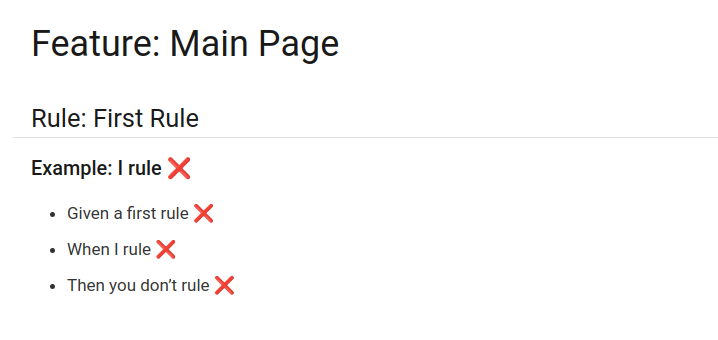

# Asciidoc Gherkin Suite

This project's goal is to introduce the ability to write Gherkin BDD scenarios in Asciidoc.

## Project Structure

- **asciidoc-gherkin-flavor**

  Contains the Asciidoc Flavor

- **asciidoc-gherkin-extension**

  An Asciidoc extension that reads ndjson messages and inserts results

- **asciidoc-gherkin-tests**

  Some integration tests to make sure the above modules work correctly together.

- **asciidoc-gherkin-antora-example**

  More advanced integration test illustrating integration with **Antora**.

## Gherkin Flavors

A modification to the original gherkin project has been proposed that introduces the concept of Gherkin Flavors and Gherkin Flavor Repository.
This feature would allow any developer to extend the Gherkin language by adding and registering a new Flavor.

Example: an Asciidoc flavor that will be associated with all files that end in "feature.adoc".

This project contains an example implementation of Asciidoc flavor located in **asciidoc-gherkin-flavor**.

## TODO
- [ ] Merge https://github.com/cucumber/messages/pull/139
- [ ] Merge https://github.com/cucumber/gherkin/pull/95
- [ ] Document Antora usage
- [ ] Provide integration with React components

## Original Inspiration
https://github.com/cucumber/gherkin/blob/main/MARKDOWN_WITH_GHERKIN.md

https://github.com/cucumber/gherkin/issues/10

## Asciidoc vs Markdown

Asciidoc is more feature-complete than Markdown and can be used to write rich technical documentation more effectively.

## Gherkin Results in Asciidoc

An Asciidoc extension is available in **asciidoc-gherkin-extension** that will read the messages in a ndjson file and insert test results in the resulting Asciidoc documents.

## Antora Integration

Since antora can load Asciidoc extensions in its playbooks it means that we can easily integrate the Gherkin Flavor in the Antora Sites

Check the **asciidoc-gherkin-antora-example** for more details.

## What About Cukedoctor ?

Cukedoctor is a project that already provides Asciidoc syntax for Gherkin but unfortunately it suffers from some major drawbacks.

- It does not use Gherkin messages format but uses the deprecated Json output.
- It is not integrateble with external tools like "Antora"

https://github.com/rmpestano/cukedoctor/issues/306
